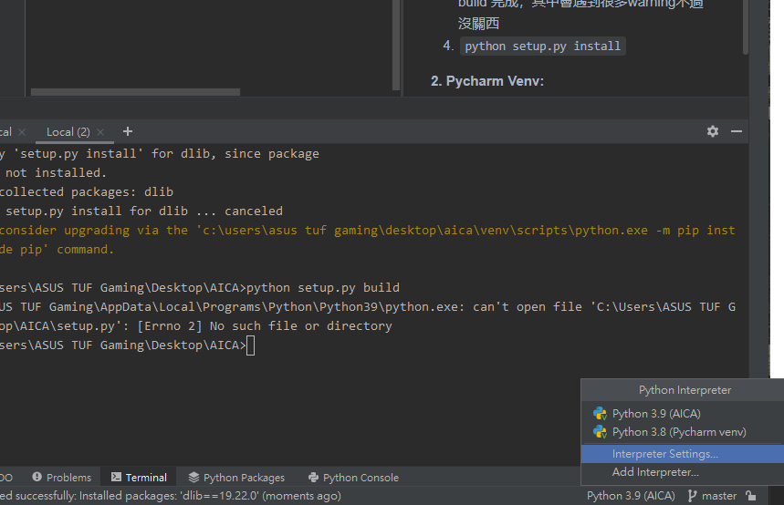
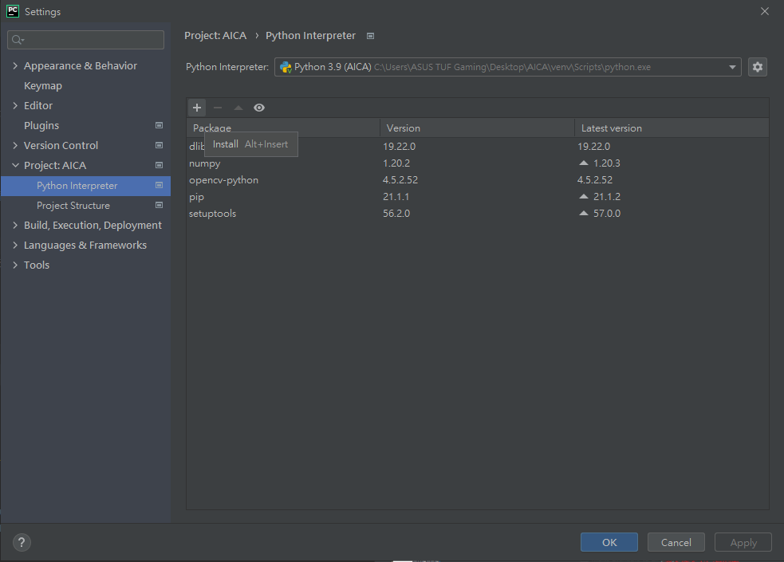
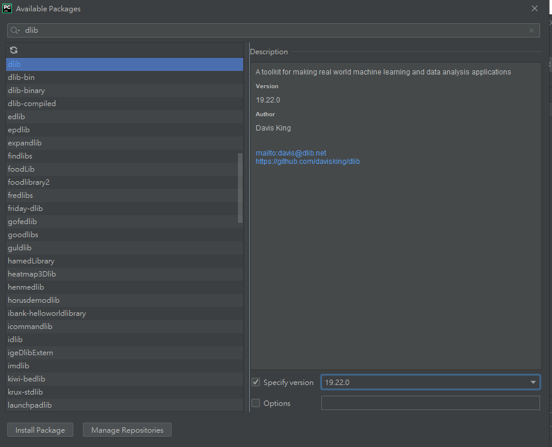

[TOC]
# Gaze Tracking
### Fork from [antoinelame / GazeTracking](https://github.com/antoinelame/GazeTracking)
### Fork from [enzg / image-background-remove-tool](https://github.com/enzg/image-background-remove-tool)
## 需要安裝的Library
Install all the dependencies from ```requirements.txt``` via ```pip install -r requirements.txt```
### 安裝 Dlib 教學
#### 方法 1. Window terminal:
1. 需先安裝: CMake, Visual Studio 2017以上
2. [CMake](https://cmake.org/download/) 安裝
> 安裝 Dlib
1. [Dlib](http://dlib.net/)
2. 解壓縮後,到 dlib-19.22 資料夾中
3. `python setup.py build` 若沒跳error就是build 完成，其中會遇到很多warning不過沒關西
4. `python setup.py install`
#### 方法 2. Pycharm Venv:
> 需先安裝 pycharm





## Execute the code:
`./setup.bat`
`python main.py`

## `main.py`:
## 操作: 
### 1. 偵測臉部:
#### 1P
```python
import cv2
import time
from Gaze_Model.Face_Detection.Face_Detection import DetectFace
_1P_Face = DetectFace("1P")
    for count in range(50): # 數秒數拍照
        if cv2.waitKey(1) == ord('q'):
            break
        _1P_Face.open(1 + count // 6)
        time.sleep(0.001)
    _1P_Face.capture("Person_1.png")
    _1P_Face = None
```
#### 2P
```python
import cv2
import time
from Gaze_Model.Face_Detection.Face_Detection import DetectFace
_2P_Face = DetectFace("2P")
    for count in range(50): # 數秒數拍照
        if cv2.waitKey(1) == ord('q'):
            break
        _2P_Face.open(1 + count // 6)
        time.sleep(0.001)
    _2P_Face.capture("Person_2.png")
    _2P_Face = None
```
### 2. 照片去背景:
> 存好的去背照片在 `Gaze_Model/Gaze_Model/Remove_BG_Remove/Capture` 資料夾中
#### 1P
```python
from Gaze_Model.Remove_BG_Remove.main import RemoveBackground as bg
ReMove = bg("Person_1.png", "Person_1_Remove.png")
ReMove = None
```
#### 2P
```python
from Gaze_Model.Remove_BG_Remove.main import RemoveBackground as bg
ReMove = bg("Person_2.png", "Person_2_Remove.png")
ReMove = None
```
### 3. 眨眼偵測
> 1. EyesModels(1P視窗位置，2P視窗位置)
> 2. text1P, text2P = Blink.open()
>   1.  text1P , text2P : 會回傳字串
>       1. `None`:沒有偵測到眼睛
>       2. `Looking`: 注視
>       3. `Blinking`: 眨眼
#### Code
```python
import keyboard
from Gaze_Model.gaze_tracking.eyes_model import EyesModel
import cv2
Blink = EyesModel([0, 0], [300, 0])
while True:
    if cv2.waitKey(1) != ord('q'):
        text1P, text2P = Blink.open()
    if keyboard.is_pressed("q"):
        print("You pressed q")
        break
Blink = None
```

# Pygame
## 套件
* python 3.8.10
* pygame 2.0.1
* (補充) dlib 我用 ```$ conda install -c conda-forge dlib``` 才成功
* 其餘同 **Gaze Tracking** 部分
## execute
```$ python game.py```
## Model
### 修正
* path problem
* read file (.dat to .txt)
* fail to capture (use while loop)
### Warning
* 一些看起來很麻煩的error, 只用try except包起來而已 :D
    * bilateralFilter
    * fail to get frame
    * ...